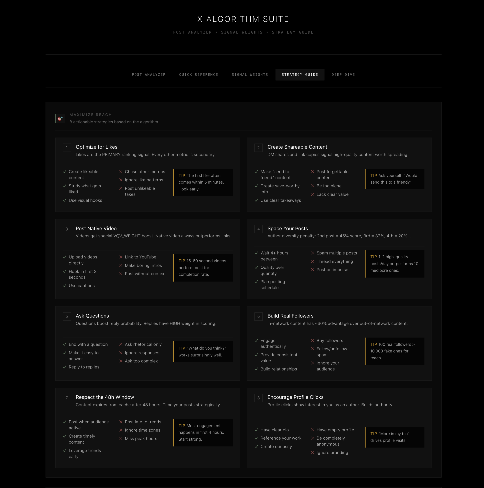
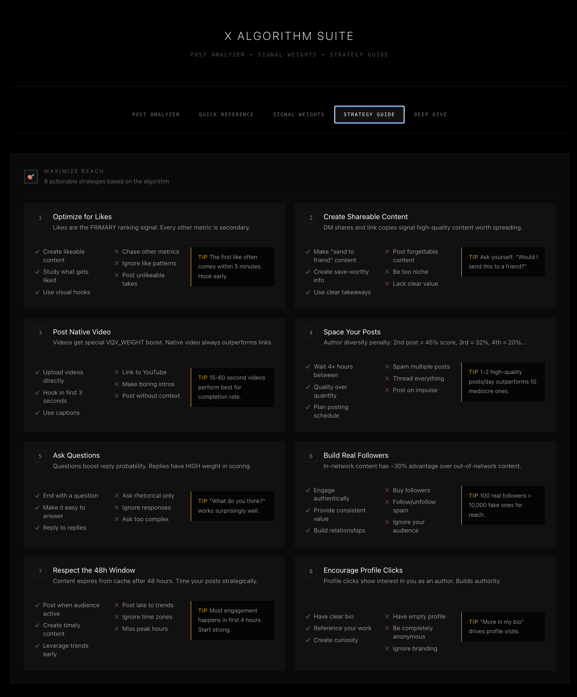
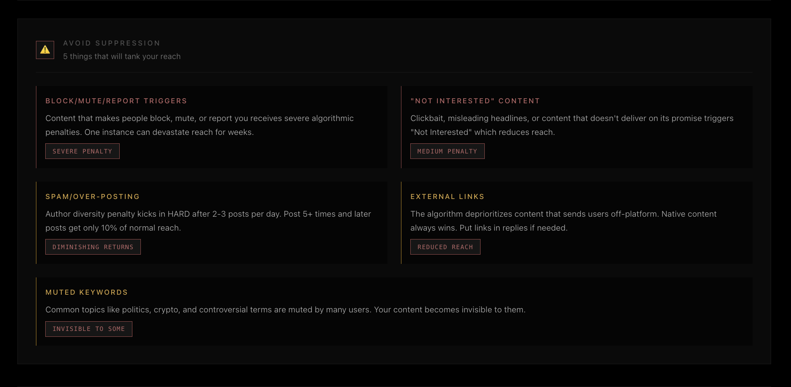

# The Hitchhiker's Guide to the X Algorithm

A comprehensive dashboard for understanding and optimizing content performance on X (formerly Twitter). Don't panic—just follow the data.



## Overview

The X Algorithm Suite provides actionable insights into how the X ranking algorithm evaluates content. Instead of guessing what works, use data-driven strategies based on actual signal weights and scoring mechanisms.

## Features

### Post Analyzer
Analyze your draft posts before publishing. Get real-time feedback on:
- Detected positive signals (video, questions, threads)
- Warning flags (external links, spam patterns)
- Engagement predictions based on content patterns
- Actionable recommendations



### Quick Reference
A cheat sheet of the most important signals:
- Primary ranking factor: **Likes**
- 48-hour scoring window
- 128 posts in relevance history
- Key timing strategies

### Signal Weights
Complete breakdown of how different signals affect your reach:

| Signal | Weight | Impact |
|--------|--------|--------|
| Likes | 30x | Highest positive signal |
| Retweets | 20x | Strong amplification |
| Replies | 1x | Base engagement |
| Video | 2x boost | Native video bonus |
| External Links | -3x | Significant penalty |



### Strategy Guide
Eight core strategies with specific do's and don'ts:
1. Optimize for Likes
2. Maximize Retweets
3. Native Video Priority
4. Strategic Timing
5. Thread Architecture
6. Visual Hierarchy
7. Engagement Bait Avoidance
8. Reply Strategy

### Deep Dive
Technical details on:
- Scoring formulas
- Author diversity calculations
- Content pipeline architecture
- Embedding and ranking systems

## Key Insights

### The Single Most Important Fact

**Likes are the PRIMARY ranking signal.** The `favorite_score` (Index 0) is what posts are sorted by. Focus on creating likeable content above all else.

### Top 5 Quick Wins

1. **Optimize for likes** - Primary metric, highest weight
2. **Post native video** - Gets special VQV_WEIGHT boost
3. **Space your posts** - Author diversity penalty is exponential
4. **Build real followers** - In-network content has inherent advantage
5. **Avoid negative triggers** - One block/mute/report can devastate reach

### Author Diversity Penalty

| Post # | Score Multiplier |
|--------|------------------|
| 1st | 100% |
| 2nd | ~45% |
| 3rd | ~32% |
| 4th | ~20% |
| 5th+ | ~10% (floor) |

### 48-Hour Window

Posts are purged from the in-network cache after 48 hours. Your content has a 2-day lifespan to gain traction.

## Design

Built with the Coyote Design System:
- Pure black backgrounds (#000000)
- Sharp corners (no border radius)
- Monospace typography (JetBrains Mono)
- High contrast, accessibility-focused

## Usage

Open `index.html` in any modern browser. No build step required.

```bash
# Open directly
open index.html

# Or run with local server
python -m http.server 8000
# Then open http://localhost:8000
```

## Structure

```
x-algorithm-suite/
├── index.html          # Complete single-file application
├── assets/
│   └── screenshots/    # Documentation images
└── README.md
```

## Sources

Algorithm insights derived from:
- X's open-source recommendation algorithm (2023)
- Platform documentation and API behavior analysis
- Community research and testing

## License

MIT License - Use freely for educational and commercial purposes.

---

*Don't panic. The answer to life, the universe, and the algorithm is 42... likes.*
